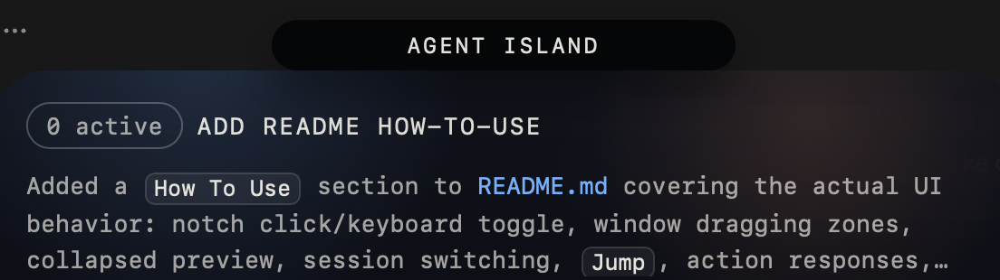
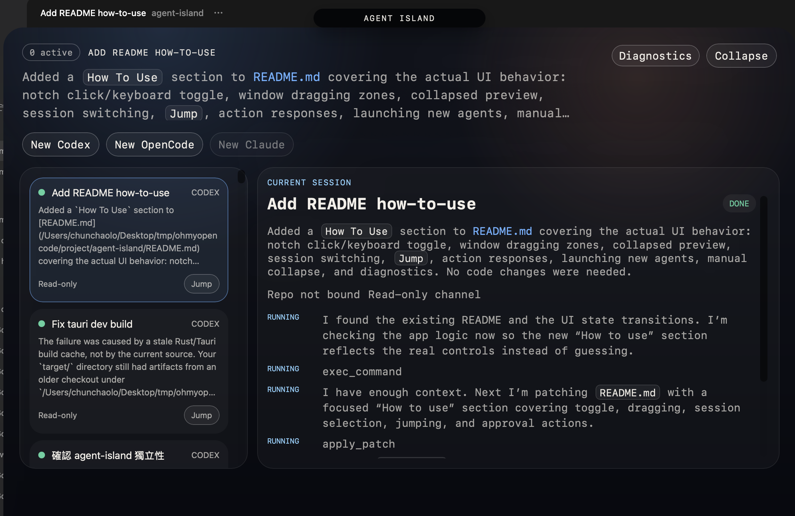

# Agent Island

<p align="center">
  
</p>

<p align="center">
  Standalone Tauri desktop app for a Vibe Island style AI-agent monitor.
</p>

<p align="center">
  A compact desktop island for watching live Codex, OpenCode, and Claude sessions,<br />
  handling approvals, and jumping back into the source tool when needed.
</p>

## Overview

Agent Island is a self-contained desktop app. It keeps the UI local, reads live session data from your machine, and gives you a single floating surface for:

- tracking multiple agent sessions
- previewing the latest session output
- responding to inline approvals and questions
- launching new sessions
- jumping back into the original tool

The app reads live data from local Claude, Codex, and OpenCode directories.

## Interface

| Collapsed | Expanded |
| --- | --- |
|  |  |

## Highlights

- **Floating notch UI**: click the notch to expand or collapse the island.
- **Live session monitor**: see active agent sessions and their latest messages in one place.
- **Approval surface**: bridge-enabled sessions can publish actions directly into the UI.
- **Quick launch toolbar**: start new `Codex`, `OpenCode`, or `Claude` sessions from the app.
- **Jump back to source**: open the selected session in its original tool when supported.
- **Self-contained repo**: frontend, Tauri shell, Rust workspace, and vendored monitor core live in this directory.

## Quick Start

### Requirements

- Node.js 20+
- npm
- Rust toolchain via `rustup`
- Tauri desktop prerequisites for your platform

macOS is the primary target. Other desktop platforms can work if the required Tauri dependencies are installed.

### Run The Desktop App

```bash
npm install
npm run tauri:dev
```

### Run Frontend Only

```bash
npm install
npm run dev
```

### Build

```bash
npm install
npm run tauri:build
```

## How To Use

### Basic Interaction

- Click the top notch to expand or collapse Agent Island.
- Drag the notch, expanded header, or collapsed preview area to move the window.

### Collapsed Mode

- The collapsed island shows the currently focused session title.
- It also shows a short preview of the latest text from that session.
- This mode is meant to stay compact while still keeping the most useful signal visible.

### Expanded Mode

- Use the session list on the left to switch between active sessions.
- The detail panel shows the selected session timeline and any pending actions.
- Click `Jump` on a session card to open that session in the source tool when a jump target exists.
- Use `Collapse` in the header to return to the compact view.

### Actions And Diagnostics

- Pending approvals or questions appear in the detail panel for the selected session.
- Click one of the action buttons to send a response back through the local bridge.
- Click `Diagnostics` to show or hide the local diagnostics overlay.

## What Is Included

- React + Vite frontend in `src/`
- Tauri shell in `src-tauri/`
- Local Rust workspace in `Cargo.toml`
- Vendored monitor core in `crates/agent_monitor_core/`

## Project Layout

```text
agent-island/
  Cargo.toml                  # Local Rust workspace
  crates/
    agent_monitor_core/       # Vendored shared monitor logic
  images/                     # README screenshots
  src/                        # React UI
  src-tauri/                  # Tauri host app
```

## Runtime Data

Agent Island stores its own local state under:

- `~/.agent-island/settings.json`
- `~/.agent-island/monitor-settings.json`
- `~/.agent-island/monitor-repo-bindings.json`

For compatibility with older setups, it can also fall back to:

- `~/.pixel-agents/settings.json`
- `~/.pixel-agents/monitor-settings.json`
- `~/.pixel-agents/monitor-repo-bindings.json`

It also reads live session data from standard tool locations such as:

- `~/.codex` or `$CODEX_HOME`
- `~/.local/share/opencode` or `$OPENCODE_DATA_DIR`

## Bridge Protocol

The app listens on a local Unix socket and accepts newline-delimited JSON messages.

### Session Registration

```json
{"type":"upsert_session","source":"codex","session_id":"abc","state":"waiting","last_text":"Waiting for approval"}
```

### Action Publishing

```json
{"type":"publish_action","action_id":"action-1","source":"codex","session_id":"abc","kind":"approval","title":"Allow command","body":"Run migration?","choices":[{"id":"allow","label":"Allow"},{"id":"deny","label":"Deny"}]}
```

### User Response

```json
{"type":"action_response","action_id":"action-1","choice_id":"allow"}
```

Bridge-enabled sessions can publish inline approval or question actions to the Unix socket shown in the header. Passive Codex and OpenCode monitoring still works without the bridge.
